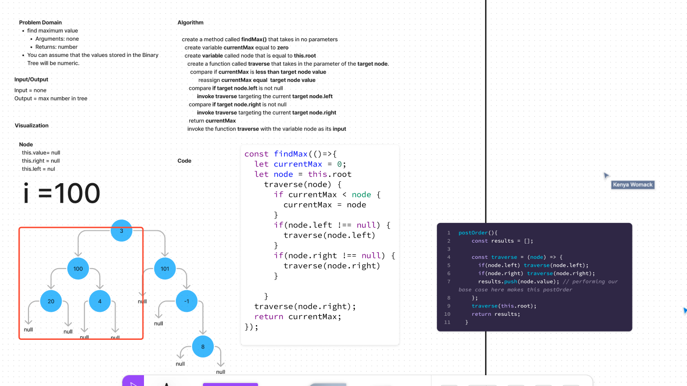

# Challenge Title
<!-- Description of the challenge -->
Binary Search Tree
## Whiteboard Process
<!-- Embedded whiteboard image -->

## Approach & Efficiency
<!-- What approach did you take? Why? What is the Big O space/time for this approach? -->
The approach was to understand that the node has to be defined and from there you you have to traverse through the  tree

## Solution
<!-- Show how to run your code, and examples of it in action -->

Code for some of the applied methods

```
    function insertNode(node, newNode) {
      if (newNode.value < node.value) {
        if (!node.left) {
          node.left = newNode;
        } else {
          insertNode(node.left, newNode);
        }
      } else {
        if (!node.right) {
          node.right = newNode;
        } else {
          insertNode(node.right, newNode);
        }
      }
    }
  }

  contains(value) {
    return searchNode(this.root, value);

    function searchNode(node, value) {
      if (!node) {
        return false;
      }

      if (value === node.value) {
        return true;
      }

      if (value < node.value) {
        return searchNode(node.left, value);
      } else {
        return searchNode(node.right, value);
      }
    }
  }
