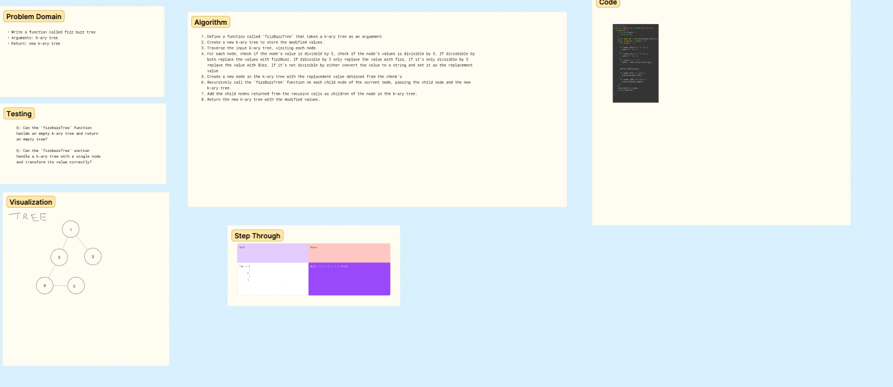
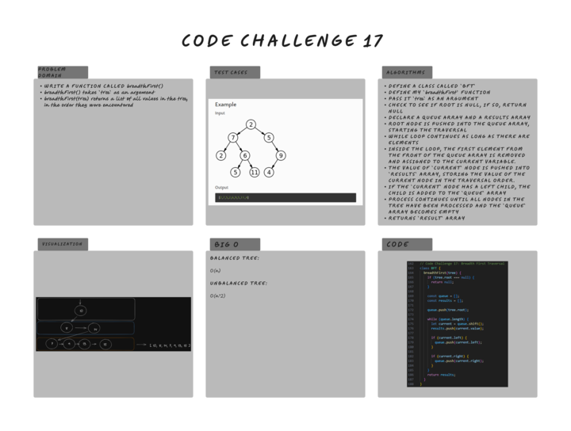

# Challenge Title
<!-- Description of the challenge -->
Binary Search Tree, Tree Breadth, FizzBuzz
## Whiteboard Process
<!-- Embedded whiteboard image -->



## Approach & Efficiency
<!-- What approach did you take? Why? What is the Big O space/time for this approach? -->

The approach was to understand that the node has to be defined and from there you you have to traverse through the  tree

**Breadth: Approach was to understand how balance trees are structured**
## Solution
<!-- Show how to run your code, and examples of it in action -->

Code for some of the applied methods
**Fizzbuzz**
```
class FizzBuzz extends BinaryTree {
  fizzBuzz() {
    if(!this.root) {
      return null;
    }
    const newTree = new BinarySearchTree();
    const traverse = (node) => {
      let value = '';

      if(node.value % 3 === 0) {
        value += 'Fizz';
      }

      if(node.value % 5 === 0) {
        value += 'Buzz';
      }
      if(value === '' ) {
        value = node.value.toString();
      }
      newTree.add(value);

      if(node.left !== null) {
        traverse(node.left);
      }
      if(node.right !== null) {
        traverse(node.right);
      }
    };
    traverse(this.root);
    return newTree;
  }
}

**Breadth**

```

breadthFirst() {
  if (this.root === null) {
    return null;
  }
  const queue = [];
  const results = [];
  queue.push(this.root);
  while (queue.length) {
    let current = queue.shift();
    results.push(current.value);
    if (current.left) {
      queue.push(current.left);
    }
    if (current.right) {
      queue.push(current.right);
    }
  }
  return results;
}


    function insertNode(node, newNode) {
      if (newNode.value < node.value) {
        if (!node.left) {
          node.left = newNode;
        } else {
          insertNode(node.left, newNode);
        }
      } else {
        if (!node.right) {
          node.right = newNode;
        } else {
          insertNode(node.right, newNode);
        }
      }
    }
  }

  contains(value) {
    return searchNode(this.root, value);

    function searchNode(node, value) {
      if (!node) {
        return false;
      }

      if (value === node.value) {
        return true;
      }

      if (value < node.value) {
        return searchNode(node.left, value);
      } else {
        return searchNode(node.right, value);
      }
    }
  }

```
