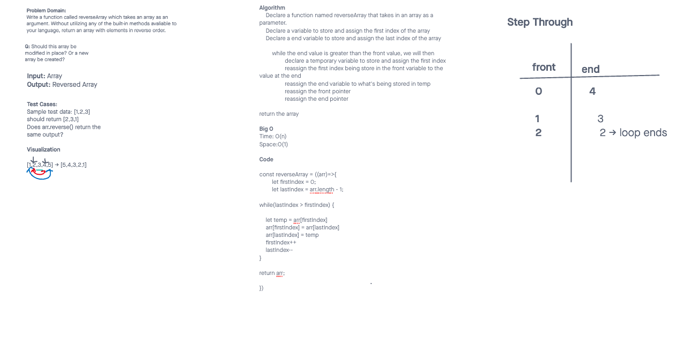

# Challenge Title
Array-Reverse

## Whiteboard Process


## Approach & Efficiency
Time: O(n): constant time

Space:O(1)

## Solution

```const reverseArray = ((arr)=>{
    let firstIndex = 0;
    let lastIndex = arr.length - 1;

while(lastIndex > firstIndex) {

let temp = arr[firstIndex]


arr[firstIndex] = arr[lastIndex]

    arr[lastIndex] = temp
    firstIndex++
    endIndex--

}
      return arr;


})```
