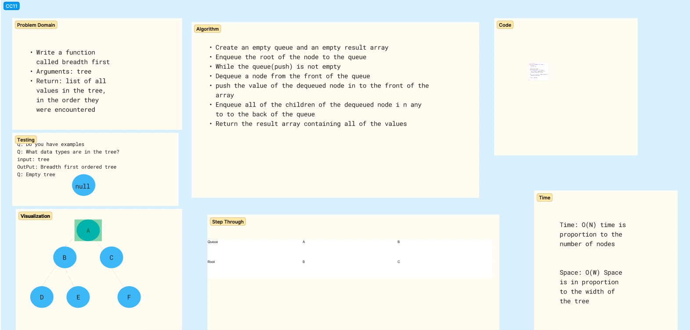

# Challenge Title
<!-- Description of the challenge -->
Tree breadth first traversal
## Whiteboard Process
<!-- Embedded whiteboard image -->

## Approach & Efficiency
<!-- What approach did you take? Why? What is the Big O space/time for this approach? -->
My approach here was to enqueue each node and then dequeue as the root was updated

## Solution
<!-- Show how to run your code, and examples of it in action -->

[Code](./index.js)
