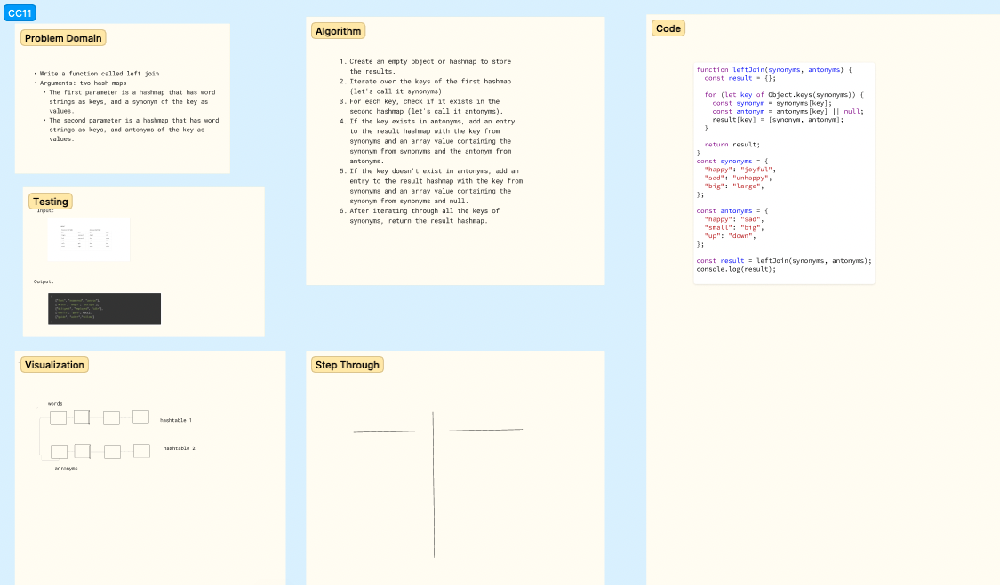

# Challenge Title
<!-- Description of the challenge -->
hash left join

## Whiteboard Process
<!-- Embedded whiteboard image -->

## Approach & Efficiency
<!-- What approach did you take? Why? What is the Big O space/time for this approach? -->
The approach was to store the synonym and antonyms in separate objects and match them at the key

## Solution
<!-- Show how to run your code, and examples of it in action -->
[Code](./index.js)
