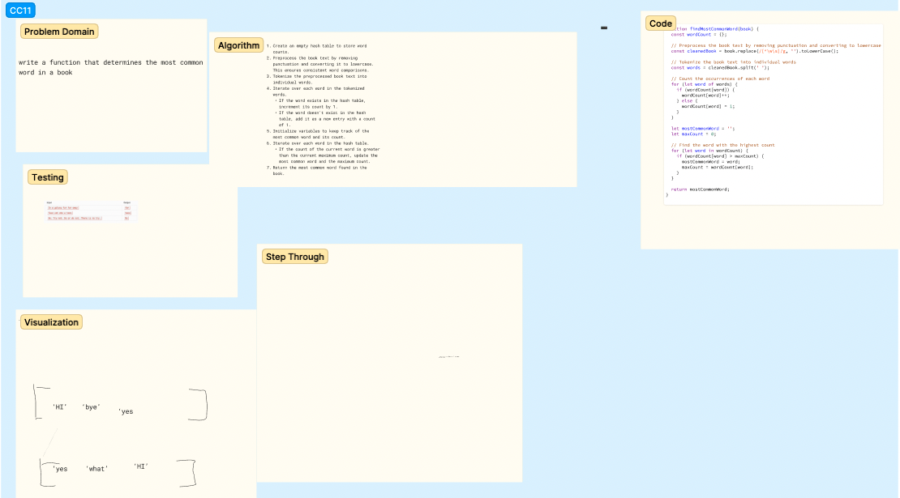

## DO ALONE CHALLENGE

My approach to doing this challenge was to start viewing hashtables like objects. I'm not that comfortable with hastables yet but what has helped based on research it seems there is a lot of flexibility with hashtables, and that they can be interpreted like objects in a lot of ways.

