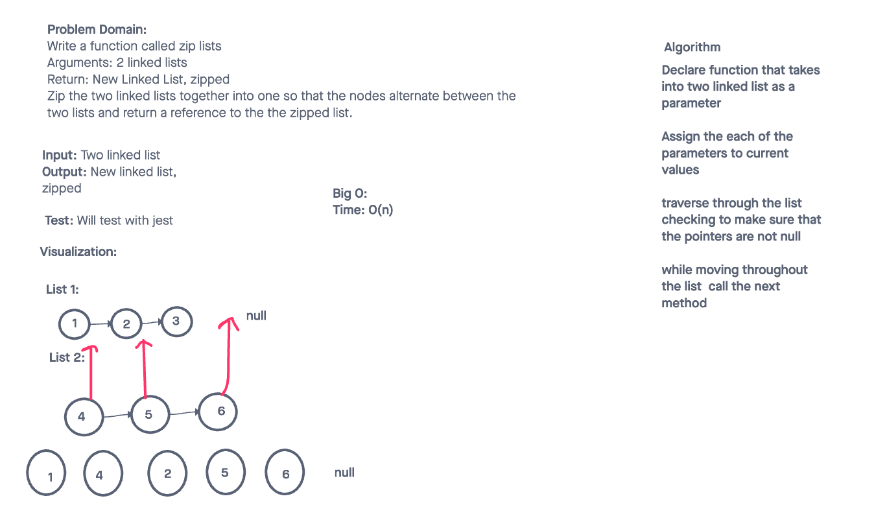

# Challenge Title
<!-- Description of the challenge -->
Linked List Insertions
## Whiteboard Process
<!-- Embedded whiteboard image -->


## Approach & Efficiency
<!-- What approach did you take? Why? What is the Big O space/time for this approach? -->

The big O for theese challenges is O(n).

## Solution
<!-- Show how to run your code, and examples of it in action -->

**This code is in reference to the kth**
```
  findTheKthNode(k) {
    let current = this.head;
    for (let i = 0; current !== null && i < k; i++) {
      if (current === null && i !== k - 1) {
        return null;
      }
      while(current !== null) {
        current = current.next;
      }
      return current;
    }
  }

**This code is in reference to linked list zip**

```
