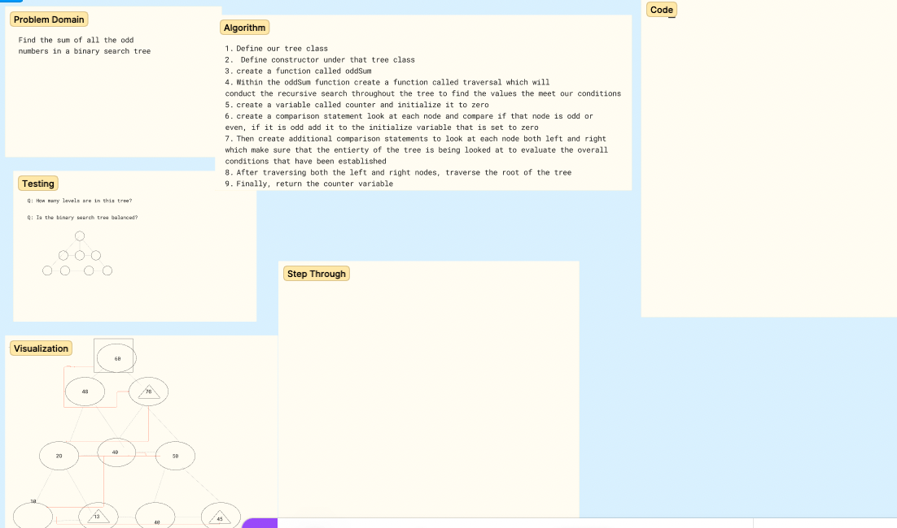

## CODE CHALLEGEN 29 WHITEBOARD REFLECTION
## DO ALONE CHALLENGE

I recently had taken some additional time to reinforce what we had been reviewing with trees, so it was great to be able to practice. Right away I noticed how having traversal as muscle memory is crucial for tackling these type of challenges.

Once you know how to move through the tree then you're faced with the problem of determining the logic that is needed to meet the conditions that the challenge is asking.

That is the portion of the problem that took me sometime to work out, which was difficult at first but I think I was able to come up with a semi working solution

