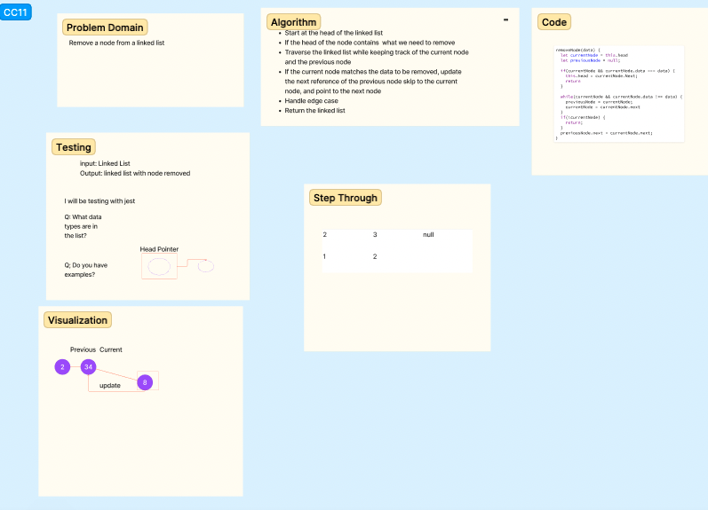

# Challenge Title
<!-- Description of the challenge -->
Remove a node from a linked list
## Whiteboard Process
<!-- Embedded whiteboard image -->

## Approach & Efficiency
<!-- What approach did you take? Why? What is the Big O space/time for this approach? -->
I began by thinking about what the edge cases would be and then establishing a previous and current variable. After moving through the list while keeping track of the previous and current to see if they matched the node to be removed. If they did then the previous node moved to the current node.

## Solution
<!-- Show how to run your code, and examples of it in action -->

[Code](./index.js)
