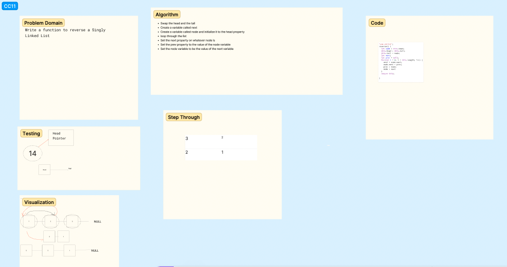

# Challenge Title
<!-- Description of the challenge -->
Reverse A Linked List
## Whiteboard Process
<!-- Embedded whiteboard image -->

## Approach & Efficiency
<!-- What approach did you take? Why? What is the Big O space/time for this approach? -->
My thought process was to iterate through the list while having the node point to the next node, but then reassining that node to the previous.

## Solution
<!-- Show how to run your code, and examples of it in action -->

[Code](./index.js)
