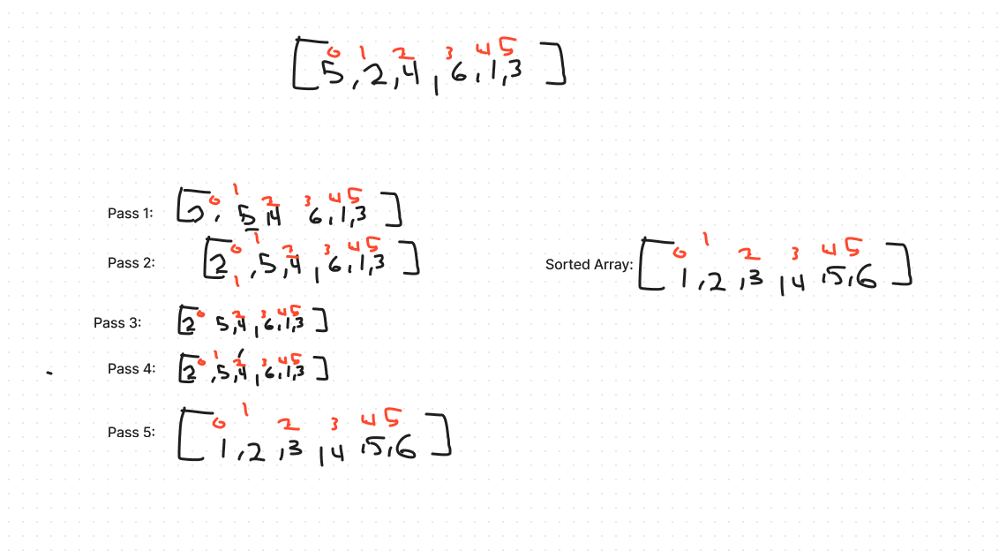

### Insertion Sort Algorithm


In this algorithm, an array of integers in ascending order using the insertion sort methodology. This slowly creates a sorted portion of the array by moving each element from the unsorted portion to the sorted portion.

**InsertionSort Function**

Sorts an array of integers using the insertion sort algorithm

```

function InsertionSort(input) {
  // Create an empty array to store the sorted elements
  let sorted = [];

  // Add the first element from the input array to the sorted array
  sorted[0] = input[0];

  // Iterate through the input array, starting from the second element
  for (let i = 1; i < input.length; i++) {
    // Insert each element into the sorted array
    Insert(sorted, input[i]);
  }

  // Return the sorted array
  return sorted;
}
```

