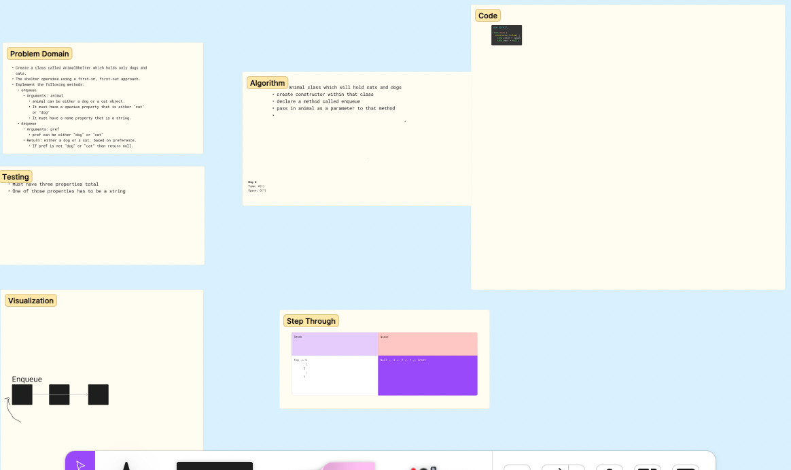

# Challenge Title
<!-- Description of the challenge -->
Animal Shelter
## Whiteboard Process
<!-- Embedded whiteboard image -->

## Approach & Efficiency
<!-- What approach did you take? Why? What is the Big O space/time for this approach? -->
Still working on implementing the solution

## Solution
<!-- Show how to run your code, and examples of it in action -->

Code for some of the applied methods

The solution is still in progress.
