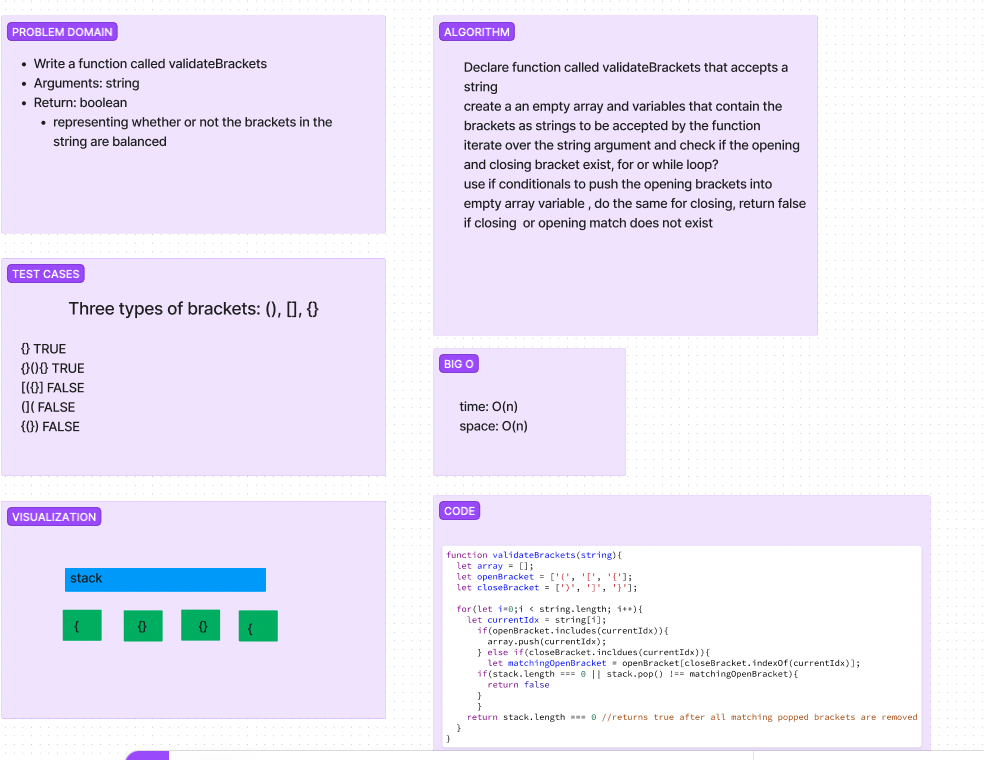

# Challenge Title
<!-- Description of the challenge -->
Stack and Queue Brackets

## Whiteboard Process
<!-- Embedded whiteboard image -->


## Approach & Efficiency
<!-- What approach did you take? Why? What is the Big O space/time for this approach? -->
We broke each bracket into an array and then interated over the arrays with conditions. If those conditions were met we pushed those indexes into a new array.

## Solution
<!-- Show how to run your code, and examples of it in action -->
```
function validateBrackets(string) {
  const stack = [];
  const openingBrackets = ['(', '[', '{'];
  const closingBrackets = [')', ']', '}'];

  for (let i = 0; i < string.length; i++) {
    const currentBracket = string[i];

    if (openingBrackets.includes(currentBracket)) {
      stack.push(currentBracket);
    } else if (closingBrackets.includes(currentBracket)) {
      const matchingOpeningBracket = openingBrackets[closingBrackets.indexOf(currentBracket)];

      if (stack.length === 0 || stack.pop() !== matchingOpeningBracket) {
        return false;
      }
    }
  }

  return stack.length === 0;
}
