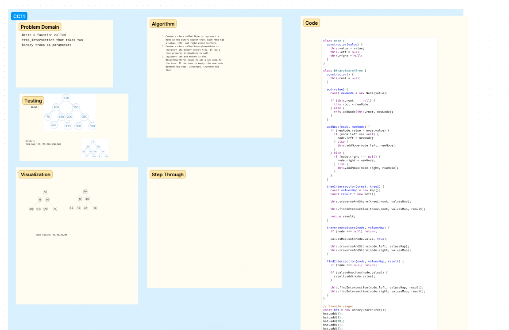

# Challenge Title
<!-- Description of the challenge -->
tree-intersection

## Whiteboard Process
<!-- Embedded whiteboard image -->

## Approach & Efficiency
<!-- What approach did you take? Why? What is the Big O space/time for this approach? -->
Used the hashtable has and add methods to evalutate which values were present in each tree

## Solution
<!-- Show how to run your code, and examples of it in action -->
[Code](./tree-intersection.js)
